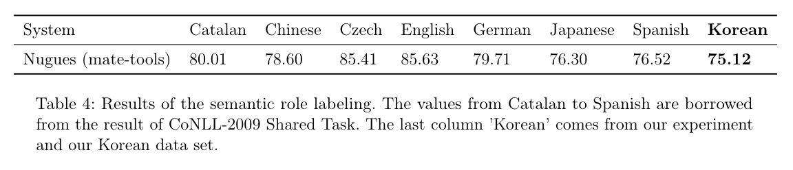

# CoNLL-2009 format of Korean
This repository introduces Korean corpus processed compatible with CoNLL-2009 Shared Task. The CoNLL-2009 Shared Task did not include Korean, so, there has been no public Korean copus which is compatible with [CoNLL-2009 Shared Task](https://www.aclweb.org/anthology/W09-1201). I've transformed a Korean corpus data which is used in the [Lee's research](http://www.koreascience.or.kr/article/JAKO201507158234848.page) to a CoNLL-2009 format.

CoNLL-2009 Shared Task provides us specification of corpus which is used for semantic role labeling (SRL) systems, especially designed for systems using syntactic dependency. With this repository's data, we can train dependency-based SRL systems even with Korean.

# Training/Evaluation Model
Although this repository is introducing a new data for incentivizing Korean semantic role labeling, we trained and evaluated a SRL system to make sure our Korean corpus is working very well with existing SRL systems using CoNLL-2009 data.

We used [mate-tools](https://code.google.com/archive/p/mate-tools/) for the SRL task. The SRLonly task in the CoNLL-2009 Shared Task specifically focused on argument identification and classificaiton (AIC). We trained mate-tools and evaluated macro F1 score to compare our result to other 7 languages' results which were already introduced in the CoNLL-2009 Shared Task.

You can download the model code at [here](https://storage.googleapis.com/google-code-archive-downloads/v2/code.google.com/mate-tools/srl-4.31.tgz). We used `srl-4.31.tgz` which is available at https://code.google.com/archive/p/mate-tools/downloads

# Information on Korean corpus 
Like Lee's data, our train data size is 4,096 sentences, and our evaluation data size is 786 sentences. 

* The train data is available at [here](https://drive.google.com/open?id=1m0edylwtff3JN3KCJXij_HT6iqC-8Crv)
* The evaluation data is availabe at [here](https://drive.google.com/open?id=1m7FvlAD9BxAeZ5lFuc09GeZMPhy0_Ml2)

# How to train/evaluate the model
1. Download and extract `srl-4.31.tgz` from the `mate-tools` repository.
2. Download our train/evaluation data (`srl.train.korean.conll` and `srl.test.korean.conll`)
3. Copy and paste `scripts/learn.sh` and `scripts/parse_srl_only.sh` from this repositroy to the extracted code repostiory (`srl-4.31/`)
4. Learn `scripts/learn.sh` to train the SRL model.
5. Learn `scripts/parse_srl_only.sh` to output the predicted output.
6. Calculate macro F1 score between `srl-korean.out` (predicted) and `srl.test.korean.conll` (true).

# Evaluation Result
Here we used macro F1 score as an evaluation metric. The Korean has achieved the worst performance, but we note that the train size is the smallest among all these languages. 

In the 7 languages except Korean, Japanese has the smallest train data, and English has the largest train data. Therefore, Japanese data made the worst performance while English data made the best score. If we collected more sentences on Korean corpus, we could get better performance from the fact that the train data size and the macro f1 score have a large correlation.